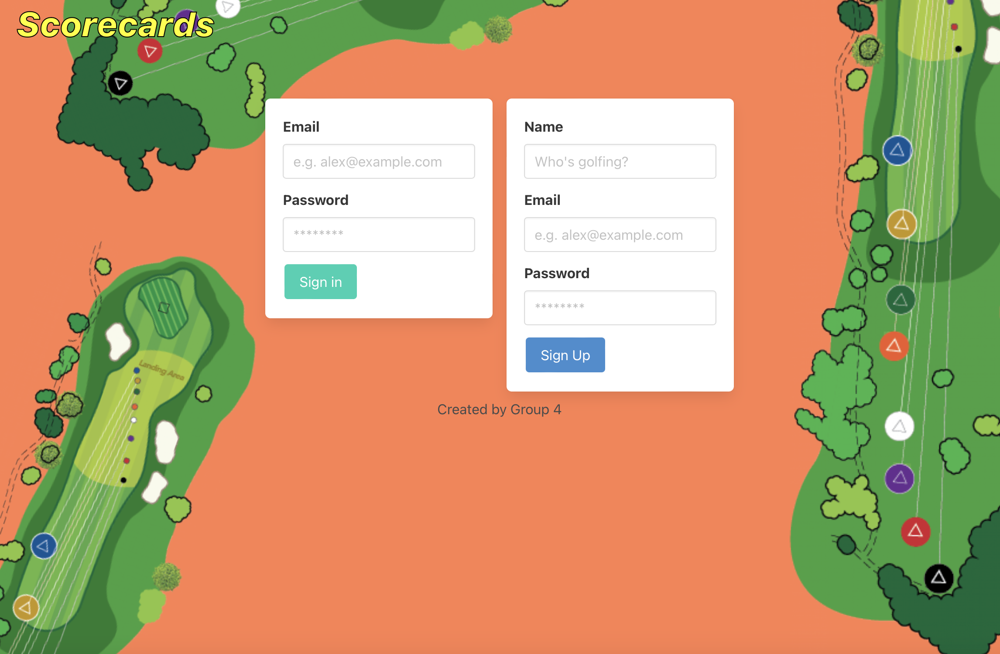

# Scorecards
  
  ## Description
  This is a full-stack application that allows a golfer to record their hole-by-hole scores, review past game scorecards, and view a chart of past game scores.  
  The user story for this project is:

    As a ... golfer
    I want ... to track my score via an application
    So that ... I can easily record, save, and view game scores.

---

  ## Table of Contents  

  - [Installation](#installation)
  - [Usage](#usage)
  - [License](#license)
  - [How to Contribute](#contribute)
  - [Tests](#tests)
  - [Questions](#questions)

---

  ## Installation
  This application uses the following node packages:  
  [bcrypt](https://www.npmjs.com/package/bcrypt) 
  [chart.js](https://www.chartjs.org) 
  [@cubejs-client/core](https://www.npmjs.com/package/@cubejs-client/core) 
  [connect-session-sequelize](https://www.npmjs.com/package/connect-session-sequelize) 
  [dotenv](https://www.npmjs.com/package/dotenv) 
  [express](https://www.npmjs.com/package/express) 
  [express-handlebars](https://www.npmjs.com/package/express-handlebars) 
  [express-session](https://www.npmjs.com/package/express-session) 
  [mysql2](https://www.npmjs.com/package/mysql2) 
  [sequelize](https://www.npmjs.com/package/sequelize) 

---

  ## Usage
  This is an Express.js application that is invoked in the command-line. The user must first create the schema from the MySQL shell. Then the server can be started by using the command: "npm start". Once the server is running, the user can visit the page in the browser to sign up and log in.  
  This app is also being hosted on [Heroku](https://sam-scorecard-app.herokuapp.com/).  
  This screenshot shows the homepage opened in the browser: 
  

---

  ## License
  
  
---

  ## Contributing
  

---

  ## Tests 
  

---

  ## Questions
  If you have any questions about the project, open an issue in GitHub or email a group member:   
  [jrwesch](https://www.github.com/jrwesch) &nbsp;&nbsp;&nbsp;&nbsp; jrwesch@gmail.com  
  [bsimmonds28](https://www.github.com/bsimmonds28) &nbsp;&nbsp;&nbsp;&nbsp; bsimmonds28@gmail.com  
  [tbgolfer86](https://www.github.com/tbgolfer86) &nbsp;&nbsp;&nbsp;&nbsp; tbj86@outlook.com  
  [sampaul10](https://www.github.com/sampaul10) &nbsp;&nbsp;&nbsp;&nbsp; sampaul10@gmail.com
